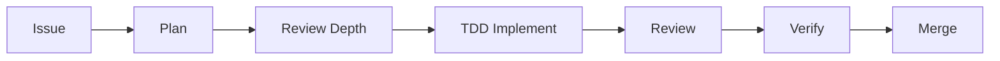

<p align="center">
  
</p>

# PASIV

> *"The PASIV device enables shared dreaming."*
>
> In Inception, the PASIV (Portable Automated Somnacin IntraVenous) device connects the team, enabling them to enter dreams together and extract what matters most. This tool does the same for your codebase - connecting your team of AI agents to extract working, tested, reviewed implementations from the seeds of ideas.

**Solo dev workflow: specs → issues → TDD implementation → review → merge.**

---

## The Team

Every extraction needs a team. PASIV connects them:

| Role | What They Do | In PASIV |
|------|--------------|----------|
| **Extractor** | Leads the operation, pulls value from the target | `/start` - orchestrates the full flow |
| **Architect** | Designs the dream levels | `/backlog` - structures specs into issues |
| **Forger** | Transforms and adapts | `/issue`, `/parent` - shapes ideas into trackable work |
| **Point Man** | Handles the details | `git-ops`, `issue-ops`, `project-ops` - the helpers |
| **Chemist** | Enables deep dreaming | TDD, verification, systematic debugging - the methodology |

---

## Install

```bash
claude plugin install github:jnew00/pasiv
```

## Quick Start

```bash
# Create a single issue
/issue add logout button to header

# Create a parent issue with sub-issues
/parent user authentication system

# Parse a spec into a full backlog
/backlog spec.md

# Start working on an issue (full extraction)
/start 42
```

## Commands

| Command | Description | Example |
|---------|-------------|---------|
| `/issue` | Create sized & labeled issue | `/issue add CSV export` |
| `/parent` | Create parent + sub-issues | `/parent user notifications` |
| `/backlog` | Parse spec into issues | `/backlog design.md` |
| `/start` | Full implementation flow | `/start 42` or `/start next` |
| `/sonnet-review` | Quick Sonnet-only review | `/sonnet-review` |
| `/3pass-review` | 3-model review pipeline | `/3pass-review feature-branch` |
| `/codex-review` | Deep Codex-only review | `/codex-review` |

## Flow Diagram



**Full flow:** Get issue → Plan (approval) → Select review depth → TDD implement → Review → Verification gate → Merge & Close

**Model delegation:**
- Simple ops (git, issue, project) → **Haiku** (cheap, forked context)
- Reviews → **Sonnet/Opus/Codex** (where quality matters)

## The `/start` Flow

> *"You mustn't be afraid to dream a little bigger, darling."*

```
/start 42
```

1. **Fetch issue details** (reliable lookup by number)
2. **Check for sub-issues** (if parent, use autonomous flow)
3. Move to **In Progress**
4. Create plan → **select review depth** → wait for approval
5. **TDD implementation** (RED → GREEN → REFACTOR → COMMIT)
6. Run tests (systematic debugging if failures)
7. **Code review** (Light/Medium/Full based on selection)
8. **Verification gate** (fresh test/build/lint evidence)
9. Check off acceptance criteria
10. Merge to main, move to **Done**, close issue

### Review Depth Selection

During plan approval, select review depth with smart recommendations:

| Depth | Models | When Recommended |
|-------|--------|------------------|
| **Light** | Sonnet | `size:S`, simple bugs |
| **Medium** | Codex | `size:M`, moderate features |
| **Full** | Sonnet → Opus → Codex | `size:L`, security files detected |

### TDD Methodology

> *"The dreamer can always remember the genesis of the idea."*

All implementation follows test-driven development:

```
RED → GREEN → REFACTOR → COMMIT → repeat
```

1. **RED**: Write failing test
2. **GREEN**: Write minimal code to pass
3. **REFACTOR**: Clean up
4. **COMMIT**: After each cycle

**Iron Law**: No production code without a failing test first.

### Verification Gate

> *"What is the most resilient parasite? An idea."*

Before merge, fresh evidence is required:

| Check | Command |
|-------|---------|
| Tests pass | `npm test` with output |
| Build succeeds | `npm run build` with exit 0 |
| Lint clean | `npm run lint` with output |

No "should work" - actual runs with actual output.

### Parent Issue Support (Autonomous)

> *"We need to go deeper."*

When you `/start` a **parent issue** with sub-issues:

```
Parent #41: User Auth System (3 sub-issues)

Implementation order:
  1. #42 Add user model        → Light  (size:S)
  2. #43 Add auth endpoints    → Full   (size:M) [security]
  3. #44 Add login UI          → Medium (size:M)

Approve and start autonomous run? [Yes/Customize/Cancel]
```

- **Approve once, walk away** - implements all sub-issues autonomously
- **Stops only on error** - asks how to proceed
- **Auto-closes parent** when all sub-issues complete

**Sub-issue priority order:**
- `area:db` → `area:infra` → `area:backend` → `area:frontend`
- Within same area: `priority:high` → `priority:medium` → `priority:low`

### Systematic Debugging

When tests fail, root cause analysis is enforced:

1. **Investigate** - Read full error, find root cause
2. **Hypothesize** - Form specific theory
3. **Test** - Make ONE minimal change
4. **Verify** - Run tests again

**Three Strikes Rule**: After 3 failed fix attempts, stop and reassess.

## Review Pipeline

**Full 3-pass flow: Sonnet → FIX → Opus → FIX → Codex → FIX → Done**

| Pass | Model | Focus |
|------|-------|-------|
| 1 | Sonnet | Bugs, security basics, missing tests |
| 2 | Opus | Architecture, edge cases, performance |
| 3 | Codex CLI | Fresh eyes, what others missed |

## GitHub Projects Integration

Issues are **automatically added** to a GitHub Project board.

- **Auto-creates project** named after your repo (on first `/issue`, `/parent`, or `/backlog`)
- **Prompts if other projects exist** (choose existing or create new)
- **Status updates**: Issues move to In Progress/Done automatically
- **Prioritization**: `/backlog` outputs suggested implementation order

### Required Token Scope

```bash
gh auth refresh -s project
```

### Implementation Order

`/backlog` prioritizes issues by:
1. Layer: `area:db` → `area:infra` → `area:backend` → `area:frontend`
2. Parent/sub-issue relationships
3. Explicit `Depends on #N` references

## Labels

| Category | Labels |
|----------|--------|
| Type | `enhancement`, `bug`, `documentation` |
| Priority | `priority:high`, `priority:medium`, `priority:low` |
| Size | `size:S` (1-4h), `size:M` (4-8h), `size:L` (8+h) |
| Area | `area:frontend`, `area:backend`, `area:infra`, `area:db` |

## Requirements

- **GitHub CLI** (`gh`) - https://cli.github.com
- **Codex CLI** - for Pass 3 reviews
- **jq** - for JSON parsing

## Setup for Your Repo

```bash
# Ensure token has project scope
gh auth refresh -s project

# Create labels (optional)
bash ~/.claude/plugins/pasiv/.github/scripts/create-labels.sh
```

## Model Optimization

Simple operations run on **Haiku** (cheap) in forked contexts to save tokens:

| Skill | Model | Operations |
|-------|-------|------------|
| `git-ops` | Haiku | branch, commit, push, merge |
| `issue-ops` | Haiku | create, close, check-off criteria |
| `project-ops` | Haiku | setup, add issue, move status |

Main skills (Sonnet/Opus) delegate to these helpers automatically.

## Plugin Structure

```
skills/
├── issue/SKILL.md              # /issue (Forger)
├── parent/SKILL.md             # /parent (Forger)
├── start/SKILL.md              # /start (Extractor)
├── sonnet-review/SKILL.md      # /sonnet-review
├── 3pass-review/SKILL.md       # /3pass-review
├── codex-review/SKILL.md       # /codex-review
├── backlog/SKILL.md            # /backlog (Architect)
│
├── tdd/SKILL.md                # TDD methodology (Chemist)
├── verification/SKILL.md       # Verification gate (Chemist)
├── systematic-debugging/SKILL.md # Debug methodology (Chemist)
│
├── git-ops/SKILL.md            # Helper (Point Man)
├── issue-ops/SKILL.md          # Helper (Point Man)
└── project-ops/SKILL.md        # Helper (Point Man)

docs/
└── plans/                      # Implementation plans

.github/
├── scripts/
│   ├── install.sh
│   └── create-labels.sh
└── workflows/
    └── version-bump.yml        # Auto-bump version on push
```

## Updating

```bash
rm -rf ~/.claude/plugins/cache
claude plugin update pasiv
```

## Acknowledgments

- Development methodology (TDD cycle, verification gates, systematic debugging) inspired by [obra/superpowers](https://github.com/obra/superpowers)
- Name and lore inspired by Christopher Nolan's *Inception* (2010)

---

> *"Do you want to take a leap of faith? Or become an old man, filled with regret, waiting to die alone?"*
>
> Connect to PASIV. `/start next`
