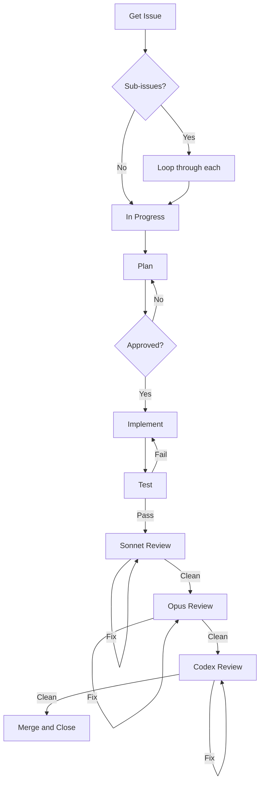

# GitHub Automation Plugin

Solo dev workflow: specs → issues → implement → test → 3-model review → merge.

## Install

```bash
claude plugin install github:jnew00/github-automation
```

## Quick Start

```bash
# Create a single issue
/issue add logout button to header

# Create a parent issue with sub-issues
/parent user authentication system

# Parse a spec into a full backlog
/backlog spec.md

# Start working on an issue (full flow)
/start 42
```

## Commands

| Command | Description | Example |
|---------|-------------|---------|
| `/issue` | Create sized & labeled issue | `/issue add CSV export` |
| `/parent` | Create parent + sub-issues | `/parent user notifications` |
| `/backlog` | Parse spec into issues | `/backlog design.md` |
| `/start` | Full implementation flow | `/start 42` or `/start next` |
| `/3pass-review` | 3-model review pipeline | `/3pass-review feature-branch` |
| `/codex-review` | Deep Codex-only review | `/codex-review` |

## Flow Diagram



**Model delegation:**
- Simple ops (git, issue, project) → **Haiku** (cheap, forked context)
- Reviews → **Sonnet/Opus/Codex** (where quality matters)

## The `/start` Flow

```
/start 42
```

1. **Fetch issue details** (reliable lookup by number)
2. **Check for sub-issues** (if parent, work through all)
3. Move to **In Progress**
4. Create plan (including tests) → wait for approval
5. Implement on feature branch
6. **Write tests** for acceptance criteria
7. **Run tests** (must pass)
8. Review: Sonnet → Opus → Codex
9. Fix errors (max 3 iterations)
10. **Check off acceptance criteria**
11. Final test run
12. Merge to main, move to **Done**, close issue

### Parent Issue Support

When you `/start` a **parent issue** that has sub-issues:

1. Lists all sub-issues with suggested implementation order
2. Moves parent to In Progress
3. Works through each sub-issue sequentially (full flow for each)
4. After all sub-issues done, parent auto-closes

**Sub-issue priority order:**
- `area:db` → `area:infra` → `area:backend` → `area:frontend`
- Within same area: `priority:high` → `priority:medium` → `priority:low`

### Status Cascading

- Starting a sub-issue → parent moves to In Progress
- Completing last sub-issue → parent moves to Done & closes

## Review Pipeline

**Flow: Sonnet → FIX → Opus → FIX → Codex → FIX → Done**

Linear progression. **STOP and fix errors after each pass before proceeding.**

| Pass | Model | Focus |
|------|-------|-------|
| 1 | Sonnet | Bugs, security basics, missing tests |
| 2 | Opus | Architecture, edge cases, performance |
| 3 | Codex CLI | Fresh eyes, what others missed |

## GitHub Projects Integration

Issues are **automatically added** to a GitHub Project board.

- **Auto-creates project** named after your repo (on first `/issue`, `/parent`, or `/backlog`)
- **Prompts if other projects exist** (choose existing or create new)
- **Status updates**: Issues move to In Progress/Done automatically
- **Prioritization**: `/backlog` outputs suggested implementation order

### Required Token Scope

```bash
gh auth refresh -s project
```

### Implementation Order

`/backlog` prioritizes issues by:
1. Layer: `area:db` → `area:infra` → `area:backend` → `area:frontend`
2. Parent/sub-issue relationships
3. Explicit `Depends on #N` references

## Labels

| Category | Labels |
|----------|--------|
| Type | `enhancement`, `bug`, `documentation` |
| Priority | `priority:high`, `priority:medium`, `priority:low` |
| Size | `size:S` (1-4h), `size:M` (4-8h), `size:L` (8+h) |
| Area | `area:frontend`, `area:backend`, `area:infra`, `area:db` |

## Requirements

- **GitHub CLI** (`gh`) - https://cli.github.com
- **Codex CLI** - for Pass 3 reviews
- **jq** - for JSON parsing

## Setup for Your Repo

```bash
# Ensure token has project scope
gh auth refresh -s project

# Create labels (optional)
bash ~/.claude/plugins/github-automation/.github/scripts/create-labels.sh
```

## Model Optimization

Simple operations run on **Haiku** (cheap) in forked contexts to save tokens:

| Skill | Model | Operations |
|-------|-------|------------|
| `git-ops` | Haiku | branch, commit, push, merge |
| `issue-ops` | Haiku | create, close, check-off criteria |
| `project-ops` | Haiku | setup, add issue, move status |

Main skills (Sonnet/Opus) delegate to these helpers automatically.

## Plugin Structure

```
skills/
├── issue/SKILL.md         # /issue
├── parent/SKILL.md        # /parent (native sub-issues)
├── start/SKILL.md         # /start (full flow)
├── 3pass-review/SKILL.md  # /3pass-review
├── codex-review/SKILL.md  # /codex-review
├── backlog/SKILL.md       # /backlog
│
├── git-ops/SKILL.md       # Helper: git operations (Haiku)
├── issue-ops/SKILL.md     # Helper: issue operations (Haiku)
└── project-ops/SKILL.md   # Helper: project operations (Haiku)

.github/
├── scripts/
│   ├── install.sh
│   └── create-labels.sh
└── workflows/
    └── version-bump.yml   # Auto-bump version on push
```

## Updating

```bash
rm -rf ~/.claude/plugins/cache
claude plugin update github-automation
```
